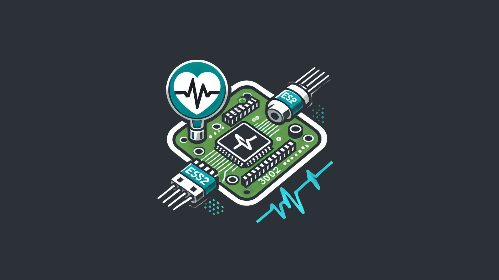

<p align="center">
  <a href="" rel="noopener">
    
  </a>
</p>

<h3 align="center">BantayKalusugan<br> SMART PORTABLE HEART RATE SENSOR SYSTEM WITH EMAIL FOR INSTANT HEALTH RESPONSE</h3>

<div align="center">

[]()
[](https://github.com/ivancotacte/HealthMonitorSystem-Arduino/issues)
[](https://github.com/ivancotacte/HealthMonitorSystem-Arduino/pulls)
[](LICENSE)

</div>

---

## 📋 Description:
Welcome to the repository for our capstone project, the Smart Portable Heart Rate Sensor System. This cutting-edge solution is designed to monitor heart rate and pulse oximetry in real-time, providing users with vital health information on-the-go. Utilizing advanced biometric sensor technology, including the MAX30102 Heart Rate and Pulse Oximeter Sensor Module, our system ensures accurate and reliable data collection.

### 🌟 Key Features:
- **Real-time Monitoring:** Continuously track your heart rate and pulse oximetry using the MAX30102 sensor.
- **Instant Alerts:** Receive email and SMS notifications for immediate health responses.
- **Auditory and Visual Alerts:** Stay informed with buzzer sounds and LED indicators.
- **LCD I2C Display:** Real-time data visualization on a convenient LCD screen.
- **ESP32 Data Transmission:** ESP32 sends data to the website via API integration.
- **Comprehensive Health Tracking:** Additional features include weight measurement.
- **User Registration:** Easily sign up and manage your profile through our website.
- **Online Dashboard:** Access and update your health data anytime, anywhere.
- **AI-Powered Assistance:** Benefit from enhanced health guidance with **GPT-4o mini** in email and SMS alerts.

## 🚀 Getting Started:
To get started with the Smart Portable Heart Rate Sensor System, follow these steps:

### Prerequisites:
- [XAMPP](https://www.apachefriends.org/index.html) installed on your machine
- Arduino IDE installed on your machine

### Setup:
1. **Clone the Repository:**
    ```sh
    git clone https://github.com/ivancotacte/HealthMonitorSystemAPI-PHP.git
    ```
2. **Navigate to the Project Directory:**
    ```sh
    cd HealthMonitorSystemAPI-PHP
    ```
3. **Start XAMPP:**
   - Open XAMPP Control Panel
   - Click `Start` for Apache and MySQL

4. **Configure the Database:**
   - Open your web browser and go to `http://localhost/phpmyadmin`
   - Create a new database named `health_monitor`
   - Import the SQL file located in the `database` folder of the cloned repository

5. **Update Database Configuration:**
   - Open `config.php` file in the project directory
   - Update the database credentials (host, username, password, database name) to match your local setup

### Running the Project:
1. **Upload Arduino Code:**
   - Connect your Arduino to the computer
   - Open the Arduino IDE
   - Load the sketch from the `arduino` folder in the cloned repository
   - Upload the code to the Arduino

2. **Access the Web Interface:**
   - Open your web browser and go to `http://localhost/HealthMonitorSystemAPI-PHP`
   - Register a new user and start monitoring your health data

## 💻 Software & Programming Language:
- PHP
- HTML / Javascript / CSS
- SQL
- C++
- Arduino IDE

## 🛠️ Components and Prices:
| Component                                                                                                             | Price (₱) | Link                                                                                                                                                                                                                                                                           |
| --------------------------------------------------------------------------------------------------------------------- | --------- | ------------------------------------------------------------------------------------------------------------------------------------------------------------------------------------------------------------------------------------------------------------------------------ |
| MAX30102 Heart Rate and Pulse Oximeter Sensor Module                                                                  | 149       | [Link](https://www.makerlab-electronics.com/products/max30102-heart-rate-and-pulse-oximeter-sensor-module-black)                                                                                                                                                                 |
| Load Sensor 50kg                                                                                                      | 120       | [Link](https://www.makerlab-electronics.com/products/load-sensor-50kg)                                                                                                                                                                                                          |
| Load Cell Amplifier HX711                                                                                             | 50        | [Link](https://makerlab-electronics.com/products/load-cell-amplifier-hx711)                                                                                                                                                                                                     |
| Buzzer (For Auditory alerting)                                                                                        | 15        | [Link](#)                                                                                                                                                                                                                                                                       |
| LED (For Visual alerting)                                                                                             | 15        | [Link](#)                                                                                                                                                                                                                                                                       |
| Type C Micro USB 5V 1A 18650 TP4056 Lithium Battery Charger Module Charging Board With Protection                      | 30        | [Link](https://www.makerlab-electronics.com/products/type-c-micro-usb-5v-1a-18650-tp4056-lithium-battery-charger-module-charging-board-with-protection)                                                                                                                          |
| SPST KCD11 Miniature Rocker Switch                                                                                    | 29        | [Link](https://www.makerlab-electronics.com/products/spst-kcd11-miniature-rocker-switch-5pcs)                                                                                                                                                                                   |
| 3.7V 2000MAh Lithium Polymer LiPo                                                                                      | 138       | [Link](https://www.lazada.com.ph/products/i4264911900-s23852767060.html?urlFlag=true&mp=1&tradePath=omItm&tradeOrderId=865368657384047&tradeOrderLineId=865368657484047&spm=spm%3Da2o42.order_details.item_title.1)                                                             |
| 1602 16x2 Character LCD Module Display HD44780 with I2C                                                               | 150       | [Link](https://www.makerlab-electronics.com/products/16x2-lcd-display-i2c-white-on-blue)                                                                                                                                                                                        |
| FR4 Universal Protoboard PCB - Double Sided                                                                           | 15        | [Link](https://www.makerlab-electronics.com/products/fr4-universal-protoboard-pcb-double-sided)                                                                                                                                                                                 |
| Lithium-ion 18650 Battery 3.7V 2200mAh                                                                                | 100       | [Link](https://www.makerlab-electronics.com/products/pkcell-lithium-ion-18650-21700-battery-3-7v-true-rated-18650-2200mah-3000mah-3350mah-4500mah-rechargeable-battery-for-power-bank-flashlight-mini-fan)                                                                      |
| Plastic Enclosure / Casing for Projects in Black                                                                      | 80        | [Link](https://www.lazada.com.ph/products/i1380034596-s5101438068.html?urlFlag=true&mp=1&tradePath=omItm&tradeOrderId=861713495484047&tradeOrderLineId=861713495584047&spm=spm%3Da2o42.order_details.item_title.1)                                                             |
| NodeMCU V3 ESP8266 ESP-12E                                                                                            | 160       | [Link](https://www.makerlab-electronics.com/products/nodemcu-v3-esp8266-esp-12e)                                                                                                                                                                                                 |
| 38 pins ESP32 WiFi IoT Development Board                                                                              | 350       | [Link](https://www.makerlab-electronics.com/products/30-pins-and-38-pins-esp32-wifi-iot-development-board)                                                                                                                                                                      |
| Jumper Wire                                                                                                           | -         | -                                                                                                                                                                                                                                                                               |
| Male Header 40 Pin                                                                                                    | 30        | [Link](https://www.makerlab-electronics.com/products/hirel-female-male-header-40-pin-machined-pin)                                                                                                                                                                              |
| MT3608 2A Max DC-DC Step Up Booster Power Module                                                                      | 30        | [Link](https://www.makerlab-electronics.com/products/mt3608-2a-max-dc-dc-step-up-booster-power-module)                                                                                                                                                                          |

## 👥 Group Members:
- Ivan A. Cotacte
- Sean Reeve B. Regala
- Johann Sebastian Kyle M. Manapsal
- Sherwin Kenjie Tom H. Cruz
- Clarence L. Saludo
- Symon Cedrick R. Zoleta
- Jimwell H. Herbon
- Mhigie D. Molon
- Bryan Miguel G. Gomez
- John Vincent E. Habig
